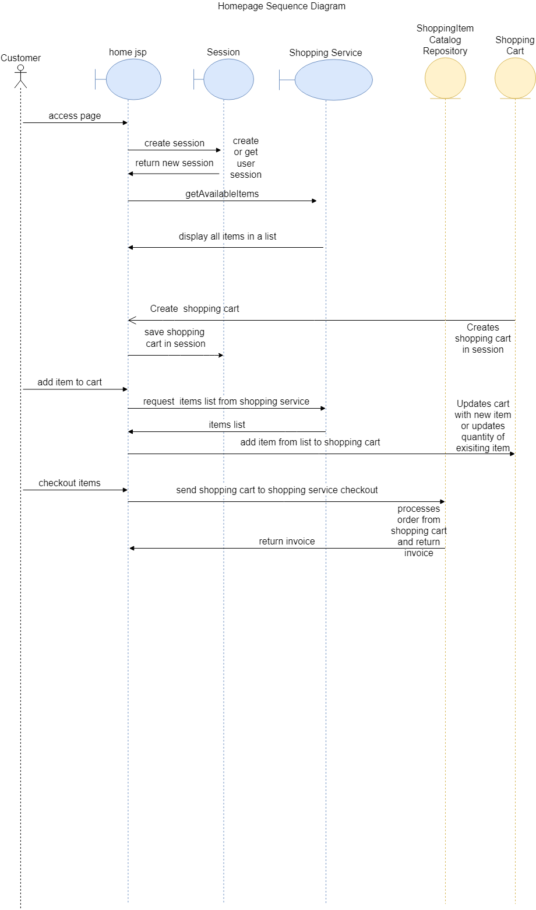

This document contains all the planning towards the project

# Features
### Home View
- List of all items
- Ability to add items to cart 
- Ability to remove items from cart

### Orders View
None as of yet

### Catalog View
- Admin - View all items in the catalog 
- Admin - Add new item to catalog 
- Admin - See total available items

### Cart View
- View all items & their quantity in the cart 
- View total cost of shopping cart 
- Enter and submit cart details for transaction
- Card details are checked and ReST client sends money
- When purchased stock levels are decreased

### Users 
- Create a new user 
- Login to an account 
- Edit account details 
- Logout of account 
- Admin - Edit an account details 

# Use Cases
Below are the use cases for the application from the point of view of 4 different users:  
`Anonymous` - A user who has not logged in  
`Customer` - A user who has logged in  
`Deactivated` - A user whose account is closed  
`Admin` - A user with elevated privileges

| ID 	| Role  	 | Action | Outcome |
| ----------- 	| ---------- | ----------- | ----------- |
| UC1			| Anonymous/Customer  | User loads into site | App displays home page with available items as a list |
| UC2			| Anonymous/Customer  | User adds item to cart | The app adds the item to the cart or increases the quantity of an existing item by 1 |
| UC3			| Anonymous/Customer  | User removes item | The app removes items from cart |
| UC4			| Anonymous  | User signs in  | The app stores the user in session storage |
| UC5			| Anonymous  | User signs up  | The app allows user to enter their details (name, address) and creates a new account in the database |
| UC6.1			| Customer  | User purchases the items in the shopping cart  | The app sends a request to the Bank REST API and sends the required total amount from the customer's card to the shop's card |
| UC6.2			| Customer  | User purchases the items in the shopping cart  | The items stock decreases by amount purchased |
| UC6.3 		| Customer  | User enters incorrect card details  | The user is displayed with an error message |
| UC7   		| Admin  | Admin adds a new item to the catalog  | The item is added to the database and becomes visible to customers |
| UC8   		| Admin  | Admin views all users  | The app shows a list of all users in the system |
| UC9 			| Admin  | Admin modifies a user | The app updates the users account to match inputted data|
| UC10 			| Customer/Admin  | User logs out  | The app removes the current user from session and turns role back to anonymous |
| UC11			| De-activated  | User attempts to login  | The app won't let user log in |

# Test Plan

### Anonymous and customer Tests
| Test ID  | Action  	 | Result |
| ----------- 	| ---------- | ---------- | 
| TC1			    | New user loads site  | Every product available is displayed on the home page |
| TC2.0    		| New user adds an item to their cart  | The cart page shows the product(s) in the cart |
| TC2.1    		|  New user adds the same item to their cart | The cart page shows the product quantity has increased by 1 |
| TC2.2    		|  New user keeps adding the same item to the cart  | A message is displayed to show the max quanitity has been reached |
| TC3   		  |  New user removes item from cart  | Item quantity in cart is decreased by 1 |
| TC4.0   		|  New user clicks "login or create a new account" and then clicks "create a new account"  | Account creation page loads |
| TC4.1   		|  User enters account details and submits  | Account is created and user is logged in |
| TC4.2 		|   User clicks on cart  | Items are stored in cart |
| TC5   		|  User clicks logout  | Account is logged out and user is returned to anonymous |
| TC6.0   		|  User clicks login  | Login page loads with all required inputs for log in  | 
| TC6.1   		|  User enters account details  | User is logged in to their account |

### Admin Tests
| Test ID 	| Action  	 | Result | 
| ----------- 	| ---------- | ---------- | 
| TC7			|  Admin clicks add item on the manage catalog page  | Page loads for admin to enter details for a new product |
| TC7.1  | The product is displayed on the home and catalog page |
| TC8   	|  Admin opens the orders page | A page loads for orders  | 
| TC9  	| Admin clicks on the users page | A page loads containing all the users in the system  | 
| TC9.1  	|  Admin clicks modify user on the users page | A page loads containing all information about the user  | 
| TC9.2  	|  Admin edits user's details | The details are changed on the user's my profile page  | 
| TC9.3 	| Admin edits user's state to de-activated | The user is unable to log in to the system  | 
| TC9.4   	| Admin edits user's state to de-activated | The user is unable to log in to the system  | 
| TC10   	| Admin clicks on manage properties page| Page loads for admin to change properties
| TC10.1 	| Admin enters properties information in to the system and clicks save | Properties information changes and is saved in file |

# UML Diagram
## Class Diagram

## Web Class Diagram

## Model Class Diagram

## Service Class Diagram

## DAO Class Diagram

## Use Case Diagram
From the diagram you can see 2 main roles, the User and the Admin, as well as another - the bank. The diagram shows all the possible actions of each role and how their actions extends from the other role.

## Robustness Diagram
Here we can see how the pages are setup and how they interact with one another

## Sequence Diagram
You can see the requests to the page including GET requests and how these interact with each layer of the application including the session, service layer and data access layer.

# Development

## Testing
For this app I have used JUnit to test all classes for greater test coverage

## Git
I have kept track of my app through the use of Github projects. In order to better help my development of the app

# Overview
This app was built with various Java technologies using [Maven] (https://maven.apache.org/) as its main project management. Maven allows the seemless entry of dependencies to the project just by reading the pom files. Another important feature of Maven is its multi-module projects this makes it so I can compile my web project to a WAR to be run by Tomcat all whilst my other projects are compiling to a JAR file.

The whole app is built with the MVC structure - Model, View & Controller using [Spring MVC](https://docs.spring.io/spring-framework/docs/3.2.x/spring-framework-reference/html/mvc.html). This allows for cleaner code and adding more features easier.

## Model Layer 
I have utilised DTO (Data Transfer Objects) for the app's model layer, which in turn will be kept in a database using [Spring Data JPA](https://docs.spring.io/spring-data/jpa/docs/current/reference/html/#reference). This way I can better spend my time on the project instead of manually writing query code for the database.

## Controller Layer

## View Layer

